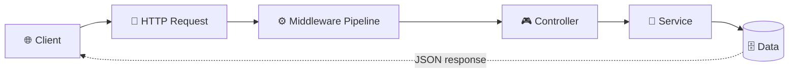
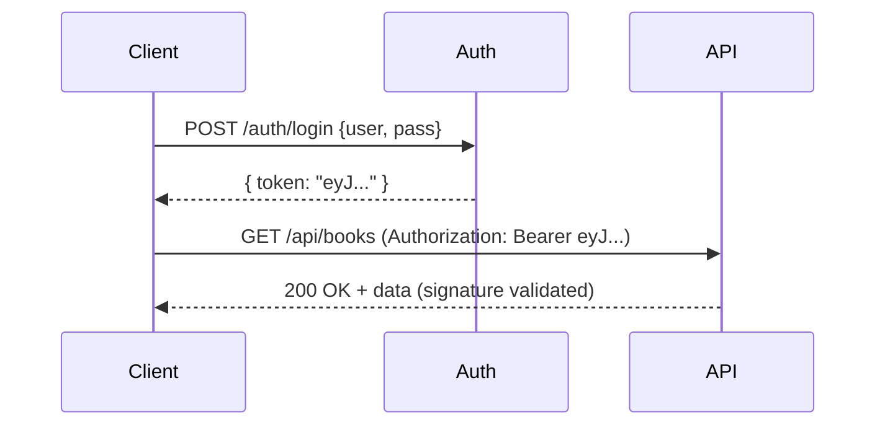

# 🎓 ASP.NET Core Web API — Visual Learning Guide

> A memory-friendly walkthrough of the **entire ASP.NET Core Web API curriculum**, with analogies, diagrams, memory aids, and a **live endpoint in this project for every topic** so you can _see_ each concept run.
>
> ▶️ Run the API (`dotnet run --project WebCoreAPI`) and open **`/swagger`** to try everything interactively.

---

## 🗺️ Table of Contents

| # | Topic | Try it in this project |
|---|-------|------------------------|
| 1 | [Introduction & Architecture](#1-introduction--architecture) | whole project |
| 2 | [HTTP Protocol](#2-http-protocol) | any endpoint |
| 3 | [Project Structure](#3-project-structure) | the repo |
| 4 | [Hosting Models & Kestrel](#4-hosting-models--kestrel) | `launchSettings.json` |
| 5 | [Dependency Injection (Lifetimes)](#5-dependency-injection--lifetimes) | `GET /api/lifetimes` |
| 6 | [Swagger / OpenAPI](#6-swagger--openapi) | `/swagger` |
| 7 | [Routing](#7-routing) | `/api/advanced-routing/*` |
| 8 | [HTTP Status Codes](#8-http-status-codes) | `/api/status-codes/*` |
| 9 | [Model Binding & Content Negotiation](#9-model-binding--content-negotiation) | `/api/binding/*` |
| 10 | [HTTP Methods (CRUD)](#10-http-methods-crud) | `/api/http-methods` |
| 11 | [Validation](#11-validation) | `/api/validation/*` |
| 12 | [Logging](#12-logging) | `/api/logging/*` |
| 13 | [Caching](#13-caching) | `/api/caching/*` |
| 14 | [Filters Pipeline](#14-filters-pipeline) | `/api/filters/*` |
| 15 | [Security & Cryptography](#15-security--cryptography) | `/api/security/*` |
| 16 | [JWT Authentication](#16-jwt-authentication) | `/api/v1/auth/*` |
| 17 | [Authorization](#17-authorization) | `/api/v1/role-demo/*` |
| 18 | [API Versioning](#18-api-versioning) | `/api/v1/books`, `/api/v2/books` |
| 19 | [CORS](#19-cors) | `/api/corsexample/*` |
| 20 | [Exception Handling](#20-exception-handling) | `/api/exceptiondemo/*` |

---

## 1. Introduction & Architecture

> 🍕 **Analogy — a restaurant.** The **Client** is a customer placing an order (HTTP request). The **Controller** is the waiter who takes it. The **Service** is the chef who cooks (business logic). The **Database** is the pantry (data). The **Model** is the menu item (shape of the data).

**Request flow:**



| Layer | Job |
|-------|-----|
| 🎮 **Controller** | Entry point. Receives requests, calls services, returns responses. Keep it **thin**. |
| 🔧 **Service** | Business logic. Injected via DI. Does the real work. |
| 📋 **Model** | Plain C# classes describing data shape (DTOs / entities). No logic. |

> 🧠 **Memory Aid — C-S-M = "Can Someone Manage?"** → **C**ontroller receives, **S**ervice processes, **M**odel holds data.

---

## 2. HTTP Protocol

> 📬 **Analogy — a formal letter.** Every request has a **To-address** (URL), a **request type** (GET/POST…), **envelope info** (Headers), and **content** (Body). The reply has a **result code** (Status Code) and **content**.

```
┌─────────── REQUEST ───────────┐        ┌─────────── RESPONSE ──────────┐
│ GET /api/books/5 HTTP/1.1      │        │ HTTP/1.1 200 OK               │
│ Host: api.myapp.com           │        │ Content-Type: application/json │
│ Authorization: Bearer eyJ...  │  ───►  │                               │
│ Accept: application/json      │  ◄───  │ { "id": 5, "title": "..." }   │
│                               │        │                               │
│ { "title": "Widget" } ← body  │        └───────────────────────────────┘
└───────────────────────────────┘
   Method · URL · Headers · Body            Status code · Headers · Body
```

---

## 3. Project Structure

```
WebCoreAPI/
├── 📄 WebCoreAPI.csproj      ← NuGet packages + .NET version
├── 📄 Program.cs            ← App entry point (Build + Configure)
├── 📄 appsettings.json      ← Config (JWT key, logging, CORS…)
├── 📁 Controllers/          ← Routes + action methods
├── 📁 Models/               ← Data shapes (Book, Author, Dtos/…)
├── 📁 Services/             ← Business logic (Jwt, User, Security, Lifetimes/…)
├── 📁 Filters/              ← Cross-cutting filter pipeline code
├── 📁 Validators/           ← FluentValidation rules
├── 📁 Authorization/        ← Custom policy requirements + handlers
├── 📁 Middleware/           ← Global exception handler
└── 📁 Properties/launchSettings.json  ← Local dev ports/env
```

> 🧠 **`Program.cs` has TWO phases.** **Build = shopping list** (register services). **Configure = using what you bought** (add middleware).

```csharp
var builder = WebApplication.CreateBuilder(args);   // PHASE 1: register services
builder.Services.AddControllers();
var app = builder.Build();                           // PHASE 2: build middleware pipeline
app.UseAuthorization();
app.MapControllers();
app.Run();
```

**Config priority (later wins):** `appsettings.json` → `appsettings.{Environment}.json` → Environment variables → Command-line args.

---

## 4. Hosting Models & Kestrel

| 🏠 In-Process (default) | 🏢 Out-of-Process |
|------------------------|-------------------|
| App runs **inside** IIS worker (`w3wp.exe`). | App runs in a **separate** process (`dotnet.exe`). |
| **Faster** — no inter-process hop. | IIS is a reverse proxy that forwards over HTTP. |
| `<AspNetCoreHostingModel>InProcess</...>` | `<AspNetCoreHostingModel>OutOfProcess</...>` |

**Kestrel** is the built-in cross-platform web server. In production it usually sits **behind a reverse proxy**:

```
Internet ──► Nginx / IIS (reverse proxy: SSL, load-balancing) ──► Kestrel (your app)
```

> 🧠 **Kestrel = the engine. Nginx/IIS = the car body.** The engine runs alone in dev; production wants the whole car.

---

## 5. Dependency Injection & Lifetimes

> 🔋 **Analogy.** Without DI you buy batteries for every toy (tight coupling). With DI a factory hands each toy the batteries it needs (loose, testable, swappable).

```
🟢 SINGLETON   Request1 ─┐                         created ONCE, lives forever
               Request2 ─┼──► [ same instance 🏠 ]   → config, caches, logging
               Request3 ─┘

🔵 SCOPED      Request1 ───► [ instance A 🏡 ]       ONE per HTTP request
               Request2 ───► [ instance B 🏡 ]       → DbContext, repositories  (most common)

🟠 TRANSIENT   inject#1 ───► [ new 🆕 ]              NEW every single injection
               inject#2 ───► [ new 🆕 ]              → lightweight stateless helpers
```

> 🧠 **Memory Aid — S.S.T. = "Same / Session / Temp"**
> **S**ingleton = **S**hared forever · **S**coped = **S**ession (request) · **T**ransient = **T**emporary.

```csharp
builder.Services.AddSingleton<ISingletonGuidService, SingletonGuidService>();
builder.Services.AddScoped<IScopedGuidService, ScopedGuidService>();
builder.Services.AddTransient<ITransientGuidService, TransientGuidService>();
```

▶️ **See it:** `GET /api/lifetimes` — call it **twice** and compare the GUIDs. Singleton is identical across calls; Scoped is equal within a call but differs between calls; Transient differs even within one call.

---

## 6. Swagger / OpenAPI

> 📖 **Analogy.** Swagger is the **interactive menu** of your API — every endpoint, what it expects, what it returns, with a "Try it out" button.

```csharp
builder.Services.AddSwaggerGen();
if (app.Environment.IsDevelopment()) { app.UseSwagger(); app.UseSwaggerUI(); }
```

▶️ **See it:** browse to **`/swagger`** (dev only — typically disabled in production).

---

## 7. Routing

> 🗺️ **Analogy — GPS.** The URL is the destination; routing finds the right "house" (action method).

**Attribute routing (used throughout this project):**

```csharp
[ApiController]
[Route("api/[controller]")]        // [controller] token → "Books"
public class BooksController : ControllerBase
{
    [HttpGet]            // GET  /api/books
    [HttpGet("{id:int}")]// GET  /api/books/5   (constraint: int only)
    [HttpPost]           // POST /api/books
}
```

**Route constraints — colon syntax `{param:type:rule}`:**

| Constraint | Matches | ⚠️ Note |
|-----------|---------|--------|
| `{id:int}` | integers | |
| `{id:int:min(1)}` | integers ≥ 1 | `min/max/range` are **integer-only** |
| `{name:alpha}` | letters | |
| `{id:guid}` | GUIDs | |
| `{date:datetime}` | dates | |
| `{price:decimal}` | decimals | for decimal **ranges**, check in code (see `AdvancedRoutingController`) |

**How routing works:**

```
Request ─► UseRouting() ─► match URL pattern ─► check constraints ─► execute action
```

▶️ **See it:** `GET /api/advanced-routing/age/30`, `/api/advanced-routing/guid/{guid}`, `/api/advanced-routing/price/9.99`.

---

## 8. HTTP Status Codes

> 🧠 **The 5 families:** **1xx** info · **2xx** ✅ success · **3xx** ↩️ redirect · **4xx** 🙋 *your* fault (client) · **5xx** 💥 *my* fault (server).

```
✅ 2xx           ↩️ 3xx              🙋 4xx                  💥 5xx
200 OK          301 Moved Perm.    400 Bad Request        500 Server Error
201 Created     302 Found (temp)   401 Unauthorized       501 Not Implemented
202 Accepted    304 Not Modified   403 Forbidden          503 Unavailable
204 No Content                     404 Not Found          504 Gateway Timeout
                                   405 Method Not Allowed
```

> 🔐 **401 vs 403 (commonly confused!)** — **401** = "Who are you? Show ID." (not authenticated). **403** = "I know you, but you can't come in." (authenticated, not authorized).

```csharp
return Ok(data);          // 200      return BadRequest(ModelState); // 400
return CreatedAtAction(); // 201      return Unauthorized();         // 401
return NoContent();       // 204      return NotFound();             // 404
return StatusCode(503);   // anything
```

▶️ **See it:** `GET /api/status-codes/200`, `/404`, `/500`, … (one endpoint per code).

---

## 9. Model Binding & Content Negotiation

> 📬 **Analogy — a smart mailroom clerk** who knows where each piece of info came from: the address label (route), a post-it (query), the envelope header, or the letter inside (body).

```
[FromRoute]  📍  URL path        GET /api/binding/route/5
[FromQuery]  ❓  ?key=value      GET /api/binding/query?page=2&size=10
[FromHeader] 📋  HTTP header     X-Client-Id: abc
[FromBody]   📦  JSON/XML body   { "name": "Widget" }
[FromForm]   📝  form-data       file uploads (multipart)
```

| Attribute | Source | Best for |
|-----------|--------|----------|
| `[FromRoute]` | URL path | IDs |
| `[FromQuery]` | `?k=v` | filters, pagination |
| `[FromBody]` | JSON body | complex objects |
| `[FromHeader]` | HTTP header | API keys, versions |
| `[FromForm]` | form data | file uploads |

**Content negotiation:** the client's `Accept` header asks for a format; the server replies with what it can produce. This project enables XML via `AddXmlSerializerFormatters()`, and `[Produces]`/`[Consumes]` declare what an action returns/accepts.

▶️ **See it:** `/api/binding/route/5`, `/api/binding/query?page=2`, `/api/binding/header` (+`X-Client-Id`), `POST /api/binding/body`.

---

## 10. HTTP Methods (CRUD)

> 🧠 **CRUD mapping:** **C**reate=POST · **R**ead=GET · **U**pdate=PUT/PATCH · **D**elete=DELETE.

| Method | CRUD | Safe? | Idempotent? | Body? | Use |
|--------|------|-------|-------------|-------|-----|
| **GET** | Read | ✅ | ✅ | ❌ | fetch |
| **POST** | Create | ❌ | ❌ | ✅ | create new |
| **PUT** | Update | ❌ | ✅ | ✅ | **replace whole** resource |
| **PATCH** | Update | ❌ | ✅ | ✅ | **partial** update |
| **DELETE** | Delete | ❌ | ✅ | ❌ | remove |
| **HEAD** | — | ✅ | ✅ | ❌ | headers only (existence) |
| **OPTIONS** | — | ✅ | ✅ | ❌ | which methods? (CORS preflight) |

> 📁 **PUT vs PATCH** — PUT replaces the **whole file** (send all fields). PATCH edits **a few lines** (send only changes).
> 🔁 **Safe** = doesn't change data. **Idempotent** = calling 10× = same as 1×. POST is neither.

▶️ **See it:** full CRUD at `/api/http-methods` (try GET, POST, PUT, PATCH, DELETE, HEAD, OPTIONS).

---

## 11. Validation

Two approaches, both demonstrated here:

| 🏷️ Data Annotations | 🌊 FluentValidation |
|---------------------|---------------------|
| Attributes on the model. | Separate validator class. |
| `[ApiController]` **auto-returns 400**. | You call `.Validate()` yourself. |
| Simple rules. | Conditional / custom / **async** rules, nested objects. |

```csharp
// Data Annotations               // FluentValidation
[Required, StringLength(100)]     RuleFor(x => x.Name).NotEmpty().Length(3,100);
public string Name { get; set; }  When(x => x.IsPhysical, () =>
[Range(0.01, 100000)]               RuleFor(x => x.Weight).GreaterThan(0));
public decimal Price { get; set; }
```

> 🧠 **Gotcha demonstrated in this repo:** `[ApiController]` validates **data annotations first** and short-circuits with a 400. So the FluentValidation endpoint uses an **annotation-free** input model (`ProductInput`) to let fluent rules actually run.

▶️ **See it:** `POST /api/validation/data-annotations` and `POST /api/validation/fluent` with an invalid body.

---

## 12. Logging

> 📝 **Analogy — a ship's log.** When something breaks, the log tells you exactly what happened and in what order.

**Levels (low → critical):**

```
Trace ─ Debug ─ Information ─ Warning ─ Error ─ Critical
 (dev)  (diag)   (normal)     (watch)   (failed) (wake someone!)
```

> 🧠 **Memory Aid:** **T**he **D**og **I**s **W**agging — **E**very **C**anine → Trace, Debug, Information, Warning, Error, Critical.

```csharp
// STRUCTURED logging — {Placeholder} values become searchable in Serilog/Seq/ELK
_logger.LogInformation("User {UserId} logged in", userId);
_logger.LogError(ex, "Failed in {Operation}", name);   // exception keeps stack trace
using (_logger.BeginScope("Order {OrderId}", id)) { ... } // group related logs
```

**Provider options:** built-in `ILogger` (this demo) · **Serilog** (most popular, structured, many sinks) · **NLog** (XML/JSON config, DB logging).

▶️ **See it:** `GET /api/logging/all-levels`, `/api/logging/exception`, `/api/logging/scope` — then watch the console.

---

## 13. Caching

> 🧠 **Analogy — a sticky note before an exam.** Look at the note first (cache hit). If it's blank, compute and write it down (cache miss).

| 🏠 In-Memory | 🌐 Distributed (Redis) | 📤 Response Caching |
|-------------|------------------------|---------------------|
| Server RAM, fastest. | Shared across servers. | Caches whole HTTP response. |
| Lost on restart. | Survives restarts. | Browser/proxy/CDN reuse. |
| Single server. | Load-balanced apps. | `[ResponseCache(Duration=…)]` |

```csharp
builder.Services.AddMemoryCache();
if (!_cache.TryGetValue("key", out var v)) {           // miss → compute + store
    v = Expensive();
    _cache.Set("key", v, TimeSpan.FromSeconds(30));
}
[ResponseCache(Duration = 30, Location = ResponseCacheLocation.Any)]  // HTTP-level
```

▶️ **See it:** `GET /api/caching/memory` (call twice within 30s — `generatedAt` stays frozen), `/api/caching/response`.

---

## 14. Filters Pipeline

> 🏭 **Analogy — airport security.** Metal detector (authorization) → ID check (resource) → document inspection (action) → board (action runs) → luggage tag (result). Anything goes wrong → emergency team (exception).

```
1️⃣ Authorization  ─ allowed in? (else 401/403)
2️⃣ Resource       ─ before model binding; can short-circuit (caching)
3️⃣ Action         ─ before & after the action method
   🎮 ── ACTION METHOD RUNS ──
4️⃣ Exception      ─ catches unhandled errors from the action
5️⃣ Result         ─ before & after the response is written
```

| | ServiceFilter | TypeFilter |
|-|---------------|------------|
| DI support | ✅ | ✅ |
| Constructor **args** | ❌ | ✅ |
| Must be DI-registered | ✅ | ❌ (created on demand) |

```csharp
builder.Services.AddControllers(o => o.Filters.Add<LoggingFilter>()); // global
[ServiceFilter(typeof(LoggingActionFilter))]   // controller/action level
[TypeFilter(typeof(DemoExceptionFilter))]
```

▶️ **See it:** `GET /api/filters/pipeline` (watch console order + the `X-Demo-Result-Filter` header), `GET /api/filters/exception` (caught by an exception filter).

---

## 15. Security & Cryptography

> 🎭 **Authentication = "Who are you?"** (login). **Authorization = "What can you do?"** (permissions). Authenticate **before** you authorize.

| Tool | Keys | Use for | In this repo |
|------|------|---------|--------------|
| **Password hashing** (PBKDF2/BCrypt) | one-way + salt | store passwords | `POST /api/security/hash` |
| **Symmetric (AES)** | same key both ways | data at rest, fast | `POST /api/security/encrypt` |
| **Asymmetric (RSA)** | public + private | key exchange, signatures | (concept) |
| **HMAC** | shared secret | message integrity | `POST /api/security/hmac` |

> ⚠️ **Never store plain-text passwords.** Hash with a **random salt** so identical passwords hash differently. Compare with a **constant-time** check (`FixedTimeEquals`) to avoid timing attacks.

▶️ **See it:** `POST /api/security/hash` `{ "password": "secret123" }` — note the same password verifies true, a wrong one false.

---

## 16. JWT Authentication

> 🎫 **Analogy — a theme-park wristband.** Pay at the gate (login) → get a wristband (JWT). Every ride (endpoint) just checks the wristband; it never calls the gate again. It's tamper-proof.

**Structure — 3 dot-separated parts:**

```
 header . payload . signature
 🔴 alg/type   🟠 claims (user, role, exp)   🔵 HMAC(header.payload, secret)
```

> ⚠️ The payload is **Base64, not encrypted** — anyone can decode it. **Never** put passwords/secrets in it.



**Refresh tokens:** access token is short-lived (~15 min); a long-lived refresh token (days) gets a new pair without re-login. Store refresh tokens in a DB so they can be **revoked**.

```csharp
app.UseAuthentication();  // MUST come before
app.UseAuthorization();   // UseAuthorization
[Authorize] / [Authorize(Roles = "Admin")]
```

▶️ **See it:** `POST /api/v1/auth/login` (`admin` / `admin123`), then call a protected endpoint with `Authorization: Bearer <token>`.

---

## 17. Authorization

This project demonstrates three flavors, all configured in `Program.cs`:

| Type | Question it answers | Example policy |
|------|---------------------|----------------|
| **Role-based** | "Is the user an Admin?" | `AdminOnly`, `ManagerOrAdmin` |
| **Claims-based** | "Does the user have security_level ≥ 3?" | `HighSecurityLevel`, `ITDepartment` |
| **Policy-based** (custom requirements + handlers) | "Does the user satisfy this composite rule?" | `SecurityLevel3`, `HighLevelManager` |

```csharp
options.AddPolicy("AdminOnly", p => p.RequireRole("Admin"));
options.AddPolicy("HighSecurityLevel", p => p.RequireClaim("security_level","3","4","5"));
options.AddPolicy("SecurityLevel3", p => p.Requirements.Add(new SecurityLevelRequirement(3)));
```

▶️ **See it** (log in first, then send the token): `GET /api/v1/role-demo/admin-only`, `/api/v1/claims-demo/high-security`, `/api/v1/policy-demo/it-department`. Log in as `admin` vs `user` to see **200 vs 403**.

---

## 18. API Versioning

> 📱 **Analogy — app-store updates.** Old users stay on v1 (still works); new users get v2. Support both during a transition.

| Strategy | Looks like | Badge |
|----------|-----------|-------|
| **Query string** | `/api/books?version=1.0` | simplest |
| **URL path** | `/api/v2/books` | most popular |
| **Header** | `X-Version: 2.0` | clean URLs |
| **Media type** | `Accept: application/json;version=2.0` | REST purist |

This project enables **all four at once** via `ApiVersionReader.Combine(...)`.

```csharp
[ApiVersion("1.0")] [ApiVersion("2.0")]
[Route("api/v{version:apiVersion}/[controller]")]
```

▶️ **See it:** `GET /api/v1/books` vs `GET /api/v2/books`, or `GET /api/books?version=2.0`.

---

## 19. CORS

**Cross-Origin Resource Sharing** controls which browser origins may call your API. Three policies are configured here: `AllowAll` (dev), `SpecificOrigins` (prod), `RestrictivePolicy`.

```csharp
builder.Services.AddCors(o => o.AddPolicy("AllowFrontend",
    p => p.WithOrigins("https://myapp.com").AllowAnyMethod().AllowAnyHeader()));
app.UseCors("AllowFrontend");   // before auth & endpoints
```

> 🧠 The browser sends an **OPTIONS preflight** first to ask "am I allowed?" — that's why `OPTIONS` matters (see §10).

▶️ **See it:** `wwwroot/cors-test.html` and `/api/corsexample/*`.

---

## 20. Exception Handling

A **global middleware** (`GlobalExceptionHandlingMiddleware`) catches unhandled exceptions and returns a consistent error shape with a correlation id — stack traces only in development.

```
Request ─► [Exception middleware] ─► … pipeline … ─► Controller
                     ▲ catches anything thrown below it
```

> 🧠 **Middleware vs Exception Filter:** middleware catches **everything** in the pipeline; an exception **filter** only catches errors from MVC actions. Prefer middleware for app-wide handling (used here).

▶️ **See it:** `/api/exceptiondemo/*` for various exception scenarios.

---

## 🏁 Quick Start

```bash
dotnet run --project WebCoreAPI
# then open:
#   https://localhost:7xxx/swagger        ← interactive docs & "Try it out"
#   GET /api/lifetimes                     ← DI lifetimes (call twice!)
#   GET /api/status-codes/404              ← status codes
#   GET /api/caching/memory                ← caching (call twice within 30s)
```

> 🎓 **You've now got a runnable example for every topic in the curriculum.** Open Swagger, poke each endpoint, and re-read the matching section above — analogy first, then the code.
